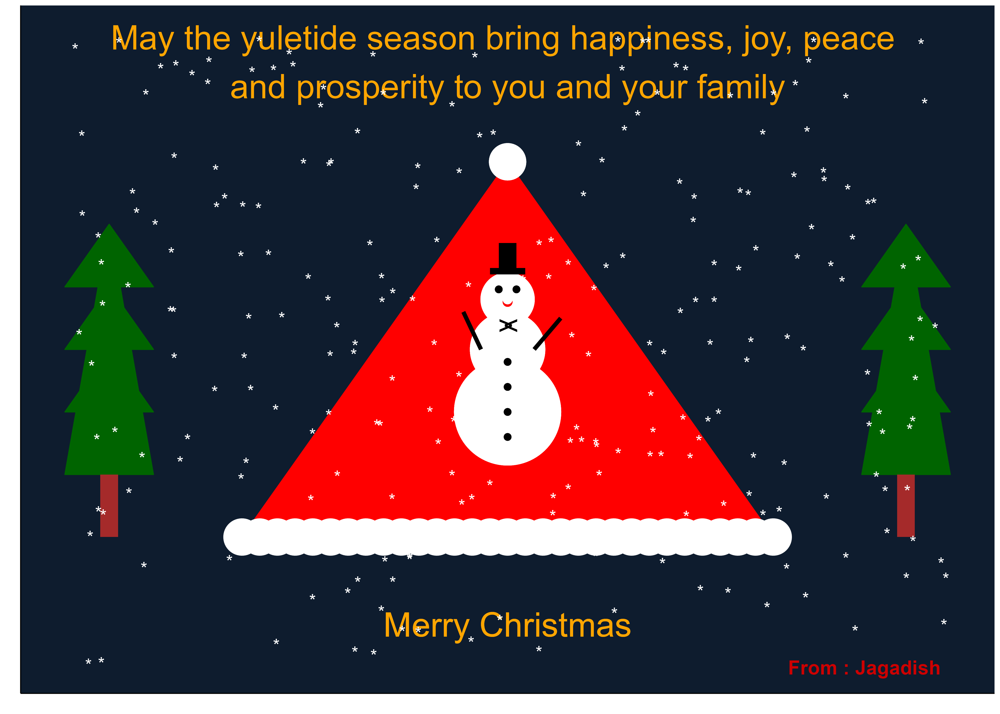

# Christmas-Card in R using ggplot2

This project creates a festive Christmas-themed visualization using R. The plot showcases a Christmas tree, ornaments, snowflakes, and a greeting message with detailed styling.

